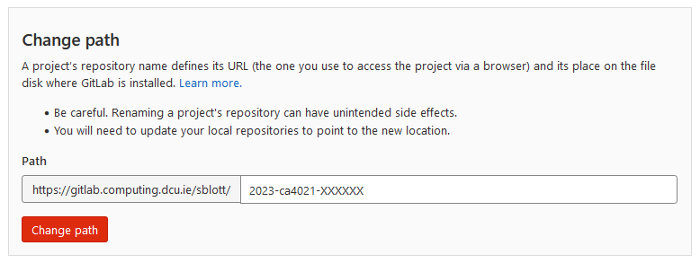

# CA4021 template repo

*You should replace all of this file with a README describing your own project.*

This is a template for CA4021 Data Science projects.

The project dashboard is [here](https://projects.computing.dcu.ie/project.html?module=ca4021).

## 1. Create your repo

One person from your project team should fork this repo, then add other teammates as project members on GitLab.

## 2. Name your repo appropriately

The name of your *repo* must match the pattern `2022-ca4021-XXXXXX`, where `XXXXXX` should be replaced with your usernames (e.g. `2022-ca4021-sblott-mbezbradica`).

**Note** that the year should be set as appropriate to your year of study. For example, in the 2022/2023 academic year this would change to '2023-ca4021-sblott-mbezbradica'), in the 2023/2024 academic year this would change to '2024-ca4021-sblott-mbezbradica'), etc.

It is the *name of your repo* that matters (not the name of your project).

You can change the name of your repo on GitLab under:
- Settings / General / Advanced / Change path

It looks like this:

## Additional resources

- Repo [hygiene](https://gitlab.computing.dcu.ie/sblott/local-gitlab-documentation/blob/master/repo-hygiene.md)
- Git [cheat sheet](https://gitlab.computing.dcu.ie/sblott/local-gitlab-documentation/blob/master/cheat-sheet.md)
- Gitlab [CI environment](https://gitlab.computing.dcu.ie/sblott/docker-ci-environment) and it's [available software](https://gitlab.computing.dcu.ie/sblott/docker-ci-environment/blob/master/Dockerfile)
- Possible project structure for Data Science work [Cookiecutter Data Science](https://drivendata.github.io/cookiecutter-data-science/)
