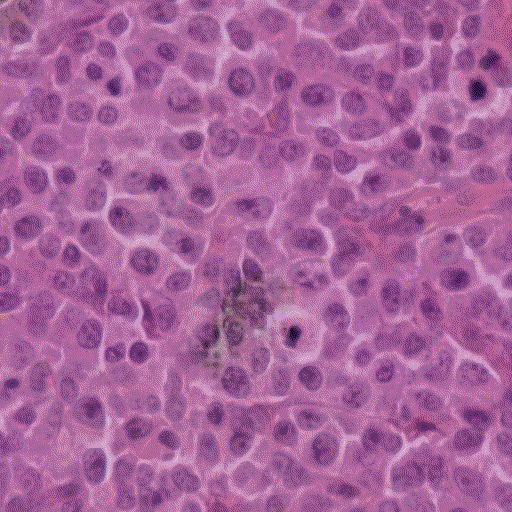
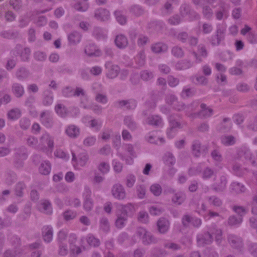
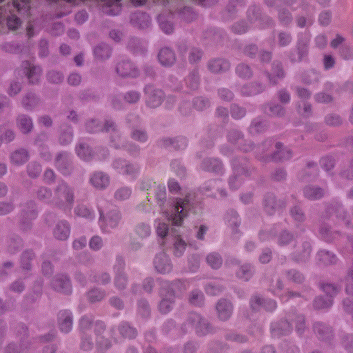
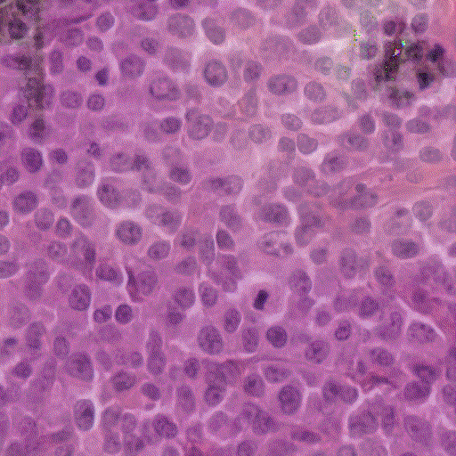

# Explainable AI in Pathology: Concept Based Explainability for Mitotic Figure Detection in Whole Slide Images

### Abstract

Advances in Artificial Intelligence (AI) are allowing the performance of models to reach new heights. These advances bring added complexity to models and reduce their explainability. AI is being applied to many interesting use cases, such as in healthcare, but these complex models that are considered “black-box” in nature are difficult to interpret. This brings with them ethical implications when the autonomy and livelihood of individuals is at stake. This project aims to discover if automated approaches can be used to bootstrap concept-based explainability approaches for use in mitotic figure detection. This would allow for the use of human-interpretable concepts without the need for an expert to curate a set of concepts manually. The approach used in this paper builds on previous work that creates segments from images and clusters those that are visually similar. These clusters act as potential visual concepts, which can then be tested using statistical methods. The automated approach outlined in this paper creates a good baseline set of concepts, but requires an iterative approach to refine these concepts for complex use cases that typically require an expert. 

### Table of contents

#### Documents
+ [Conference Paper](docs/Explainable%20AI%20in%20Pathology%20-%20Concept%20Based%20Explainability%20for%20Mitotic%20Figure%20Detection%20in%20Whole%20Slide%20Images.pdf)
+ [Project Proposal](docs/Adam_Tegart_19327493_FYP_Proposal.pdf)
+ [Questionnaire](docs/questionnaire.pdf)

#### Google Drive

The Google Drive folder can be found [here](https://drive.google.com/drive/folders/1xoxOql6JeDOZBHS6p5Cs1l53mUMesJSG?usp=sharing). It contains a link to the original MIDOG data, the training data, the discovery data, the results and saves of the models I used.

#### Notebooks
+ [Data Loading](Data_loading_and_preprocessing.ipynb)
+ [Model Training](Model_training_and_evaluation.ipynb)
+ [Automated Concept Extraction](Automated_concept_extraction.ipynb)
+ [Gifsplanation](Gifsplanation.ipynb)

There are addtional utility files in the Utils folder. These are commented and used in the above notebooks.

#### Generated GIFs

##### Gradient only

##### Gradient and CAV

